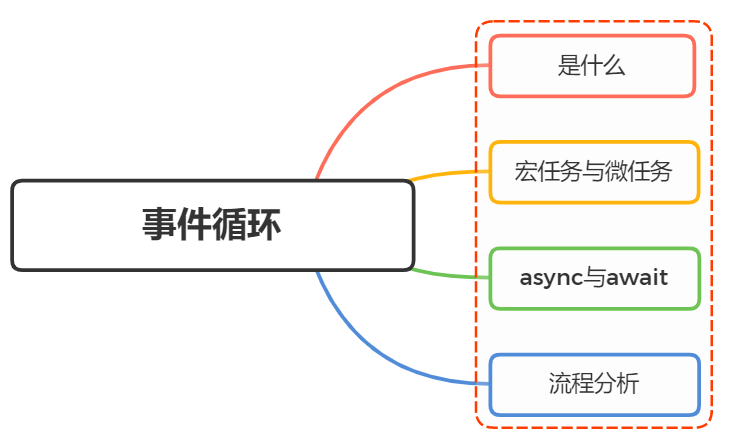
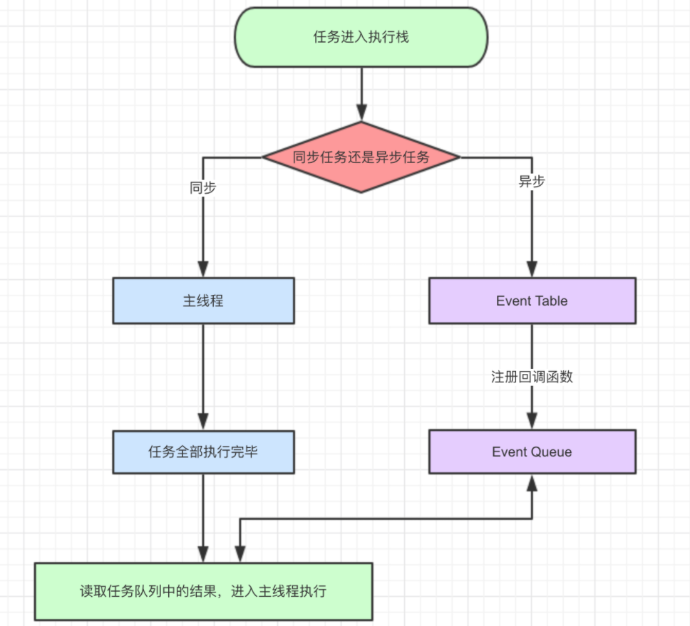

## JavaScript的事件循环



### 是什么

JavaScript 在设计之初便是单线程，即指程序运行时，只有一个线程存在，同一时间只能做一件事

为什么要这么设计，跟 JavaScript 的应用场景有关

JavaScript 初期作为一门浏览器脚本语言，通常用于操作 DOM ，如果是多线程，一个线程进行了删除 DOM ，另一个添加 DOM，此时浏览器该如何处理？

为了解决单线程运行阻塞问题，JavaScript 用到了计算机系统的一种运行机制，这种机制就叫做事件循环（Event Loop）
在 JavaScript 中，所有的任务都可以分为

- 同步任务：立即执行的任务，同步任务一般会直接进入到主线程中执行

- 异步任务：异步执行的任务，比如 ajax 网络请求，setTimeout 定时函数等

同步任务与异步任务的运行流程图如下：


### 消息队列

一个 JavaScript 运行时包含了一个待处理消息的消息队列。每一个消息都关联着一个用以处理这个消息的回调函数。
在 事件循环 期间的某个时刻，运行时会从最先进入队列的消息开始处理队列中的消息。被处理的消息会被移出队列，并作为输入参数来调用与之关联的函数。正如前面所提到的，调用一个函数总是会为其创造一个新的栈帧。

函数的处理会一直进行到执行栈再次为空为止；然后事件循环将会处理队列中的下一个消息（如果还有的话）。

### 事件循环

之所以称之为 事件循环，是因为它经常按照类似如下的方式来被实现：

```js
while (queue.waitForMessage()) {
  queue.processNextMessage();
}
```

- **添加消息**
  在浏览器里，每当一个事件发生并且有一个事件监听器绑定在该事件上时，一个消息就会被添加进消息队列。如果没有事件监听器，这个事件将会丢失。所以当一个带有点击事件处理器的元素被点击时，就会像其他事件一样产生一个类似的消息。

### 宏任务与微任务

事件循环，宏任务，微任务的关系如图所示


### 流程分析

- 示例 1
- 示例 2

```js
const s = Date.now();

// 时间值代表了消息被实际加入到队列的最小延迟时间
// 代码同步执行到时间定时器setTimeout后，注册回调，计时器就已经开始计时
setTimeout(function () {
  // 输出 "2"，表示回调函数并没有在 500 毫秒之后立即执行
  console.log('Ran after ' + (Date.now() - s) + ' ms');
}, 500);

while (true) {
  if (Date.now() - s >= 2000) {
    console.log('Good, looped for 2000 ms');
    break;
  }
}
```

- 示例 3

```js
console.log(1);
setTimeout(() => {
  console.log(2);
}, 0);
new Promise((resolve, reject) => {
  console.log('new Promise');
  resolve();
}).then(() => {
  console.log('then');
});
console.log(3);

// 执行结果：
// 遇到 console.log(1) ，直接打印 1
// 遇到定时器，属于新的宏任务，留着后面执行
// 遇到 new Promise，这个是直接执行的，打印 'new Promise'
// .then 属于微任务，放入微任务队列，后面再执行
// 遇到 console.log(3) 直接打印 3
// 好了本轮宏任务执行完毕，现在去微任务列表查看是否有微任务，发现 .then 的回调，执行它，打印 'then'
// 当一次宏任务执行完，再去执行新的宏任务，这里就剩一个定时器的宏任务了，执行它，打印 2
```

- 示例 4

```js
console.log(1);
setTimeout(() => {
  console.log(2);
}, 100);
new Promise((resolve, reject) => {
  console.log('new Promise - 1');
  setTimeout(() => {
    console.log('Promise setTimeout');
    resolve();
  }, 0);
}).then(() => {
  console.log('then - 1');
});
console.log(3);

// 执行结果：
// 1
// new Promise - 1
// 3
// Promise setTimeout
// then - 1
// 2
```

- 示例 5

```js
console.log(1);
setTimeout(() => {
  console.log(2);
}, 100);
new Promise((resolve, reject) => {
  console.log('new Promise - 1');
  setTimeout(() => {
    console.log('Promise setTimeout');
    resolve();
  }, 0);
}).then(() => {
  console.log('then - 1');
});

new Promise((resolve, reject) => {
  console.log('new Promise - 2');
  resolve();
}).then(() => {
  console.log('then - 2');
});

console.log(3);

// 执行结果：
// 1
// new Promise - 1
// new Promise - 2
// 3
// then - 2
// Promise setTimeout
// then - 1
// 2
```

- 示例 6

```js
// 当前执行的script 就是一个Macrotask
const s = Date.now();

console.log(1);
// 将时间定时器的事件消息添加到宏任务的消息队列
setTimeout(() => {
  console.log(2);
}, 100);
new Promise((resolve, reject) => {
  console.log('new Promise - 1');
  // 将时间定时器的事件消息添加到宏任务的消息队列，位置在时间为100ms的定时器之前
  // 下次事件循环开始执行时，从宏任务的消息队列出队一个宏任务的消息，并调用其回调函数
  // 该回调函数打印"Promise setTimeout"，并将Promise resolve的消息加入微任务的消息队列
  setTimeout(() => {
    console.log('Promise setTimeout');
    resolve();
  }, 0);
})
  .then(() => {
    // 下次事件循环执行宏任务（即：前面'Promise setTimeout'的时间定时器的回调函数），在执行栈空闲后，check微任务的消息队列，如果有消息，那么出队，压入执行栈执行回调函数，执行栈空闲后，继续check微任务的消息队列
    // 如此循环直至微任务的消息队列为空
    console.log('then - 1');
  })
  .then(() => {
    console.log('then - 2');
  });

new Promise((resolve, reject) => {
  console.log('new Promise - 2');
  resolve(); // script宏任务压入执行栈，将Promise resolve后的消息添加到微任务的消息队列，
})
  .then(() => {
    // 在初次事件循环中，宏任务script执行完毕，执行栈空闲后，从最先进入微任务消息队列中的消息开始处理队列中的消息。被处理的消息会被移出队列，并作为输入参数来调用与之关联的函数
    // 该回回调函数被放入执行栈执行后，将一个Promise resolve的消息添加到微任务的消息队列；此时执行栈空闲，微任务的消息队列被添加进了新的Promise resolve消息
    // 继续check微任务的消息队列，如果还有微任务的消息，那么继续执行回调，如此循环直至，初次事件循环中，微任务的消息队列为空
    console.log('then - 3');
  })
  .then(() => {
    console.log('then - 4');
  });

console.log(3);

while (true) {
  if (Date.now() - s >= 2000) {
    console.log('Good, looped for 2000 ms');
    break;
  }
}

// 执行结果：
// 1
// new Promise - 1
// new Promise - 2
// 3
// Good, looped for 2000 ms
// then - 3
// then - 4
// Promise setTimeout
// then - 1
// then - 2
// 2
```

- 示例 7
  - 三个 timeout 最小延迟执行时间为 200,100,0ms,while 重复执行时间上限为 2000ms

```js
// 当前执行的script 就是一个Macrotask
// 此时宏任务队列：[script]
const s = Date.now();

console.log(1);
// 在初次事件循环，执行script宏任务时，将时间定时器的事件消息添加到宏任务的消息队列
// 在初次事件循环结束，宏任务队列为：[setTimeout("Promise setTimeout"), setTimeout('2 - setTimeout'), setTimeout("then setTimeout - 1")],
// 第三次次事件循环开始执行，执行宏任务setTimeout("2 - setTimeout")，打印"2 - setTimeout"，并将Promise resolve的消息加入微任务的消息队列，
// 此时微任务队列为[then("then - 5")]
setTimeout(() => {
  console.log('2 - setTimeout');
  // 在第三次事件循环中，宏任务setTimeout('2 - setTimeout')执行完毕后，check微任务的消息队列then("then - 5")出队
  // 回调函数被放入执行栈执行，打印"then - 5", 至此微任务的消息队列为空，开始下一轮事件循环
  // 此时宏任务队列为[setTimeout("then setTimeout - 1")]
  Promise.resolve().then(() => console.log('then - 5'));
}, 200);
new Promise((resolve, reject) => {
  console.log('new Promise - 1');
  // 在初次事件循环，执行script宏任务时，将时间定时器的事件消息添加到宏任务的消息队列
  // 在初次事件循环结束，宏任务队列为：[setTimeout("Promise setTimeout"), setTimeout('2 - setTimeout'), setTimeout("then setTimeout - 1")],
  // 第二次事件循环开始执行，执行宏任务setTimeout("Promise setTimeout")，打印"Promise setTimeout"，并将Promise resolve的消息加入微任务的消息队列，
  // 此时微任务队列为[then("then - 1")]
  setTimeout(() => {
    console.log('Promise setTimeout');
    resolve();
  }, 100);
})
  .then(() => {
    // 在第二次事件循环中，宏任务setTimeout("Promise setTimeout")执行完毕后，check微任务的消息队列then("then - 1")出队
    // 回调函数被放入执行栈执行，打印"then - 1"，返回一个Promise resolved，将其加入微任务的消息队列
    // 此时微任务队列为[then("then - 2")]
    console.log('then - 1');
  })
  .then(() => {
    // 微任务then("then - 1")出队，执行完毕后，check微任务的消息队列then("then - 2")出队
    // 回调函数被放入执行栈执行，打印"then - 2", 至此微任务的消息队列为空，开始下一轮事件循环
    // 此时宏任务队列为[setTimeout('2 - setTimeout'), setTimeout("then setTimeout - 1")]
    console.log('then - 2');
  });

new Promise((resolve, reject) => {
  console.log('new Promise - 2');
  resolve(); // 在执行宏任务script时，到此处，将Promise resolve后的消息添加到微任务的消息队列，微任务队列为[then("then - 3")]
})
  .then(() => {
    // 在初次事件循环中，宏任务script执行完毕后，check微任务的消息队列then("then - 3")出队，
    // 回调函数被放入执行栈执行后，打印"then - 3"，创建Promise对象并将setTimeout("then setTimeout - 1")添加到宏任务的队列
    // 至此微任务的消息队列为空，宏任务script的初次事件循环结束，开始下一轮事件循环
    // 此时宏任务队列为[setTimeout("Promise setTimeout"), setTimeout('2 - setTimeout'), setTimeout("then setTimeout - 1")]
    console.log('then - 3');
    return new Promise((resolve) => {
      // 第四次事件循环开始执行，执行宏任务setTimeout("then setTimeout - 1")，打印"then setTimeout - 1"，并将Promise resolve的消息加入微任务的消息队列，
      // 此时微任务队列为[then("then - 4")]
      setTimeout(() => {
        console.log('then setTimeout - 1');
        resolve();
      }, 0);
    });
  })
  .then(() => {
    // 在第四次事件循环中，宏任务setTimeout("then setTimeout - 1")执行完毕后，check微任务的消息队列then("then - 4")出队
    // 回调函数被放入执行栈执行，打印"then - 4"，至此微任务的消息队列为空
    // 此时宏任务队列为空，整个程序运行结束
    console.log('then - 4');
  });

console.log(3);

while (true) {
  if (Date.now() - s >= 2000) {
    console.log('Good, looped for 2000 ms');
    break;
  }
}

// 执行结果：
// 1
// new Promise - 1
// new Promise - 2
// 3
// Good, looped for 2000 ms
// then - 3
// Promise setTimeout
// then - 1
// then - 2
// 2 - setTimeout
// then - 5
// then setTimeout - 1
// then - 4
```

- 示例 8
  - 三个 timeout 最小延迟执行时间为 2000,1000,0ms

```js
// 执行结果：
// 1
// new Promise - 1
// new Promise - 2
// 3
// Good, looped for 2000 ms
// then - 3
// Promise setTimeout
// then - 1
// then - 2
// then setTimeout - 1
// then - 4
// 2 - setTimeout
// then - 5
```

- 示例 9
  - 三个 timeout 最小延迟执行时间为 2500,2000,0ms,while 重复执行时间上限为 2000ms

```js
// 执行结果：
// 1
// new Promise - 1
// new Promise - 2
// 3
// Good, looped for 2000 ms
// then - 3
// then setTimeout - 1
// then - 4
// Promise setTimeout
// then - 1
// then - 2
// 2 - setTimeout
// then - 5
```

- 示例 10
  - 三个 timeout 最小延迟执行时间为 2500,2000,0ms,while 重复执行时间上限为 3000ms

```js
// 执行结果：
// 1
// new Promise - 1
// new Promise - 2
// 3
// Good, looped for 3000 ms
// then - 3
// Promise setTimeout
// then - 1
// then - 2
// 2 - setTimeout
// then - 5
// then setTimeout - 1
// then - 4
```

- 示例 11
  [dom event test](./assets/event-loop.html)

### 参阅

- [面试官：说说对 Nodejs 中的事件循环机制理解?](https://vue3js.cn/interview/NodeJS/event_loop.html)
- [面试官：说说你对浏览器事件循环的理解](https://github.com/febobo/web-interview/issues/73)
- [【THE LAST TIME】彻底吃透 JavaScript 执行机制](https://mp.weixin.qq.com/s/nQgsEQorv00fr4XqU764bA)
- [事件循环-MDN](https://developer.mozilla.org/zh-CN/docs/Web/JavaScript/EventLoop)
- [从event loop规范探究javaScript异步及浏览器更新渲染时机](https://github.com/aooy/blog/issues/5)
- [Event loop 及 macrotask & microtask](https://zhuanlan.zhihu.com/p/76131519)
- [HTML-Living Standard](https://html.spec.whatwg.org/#event-loop)