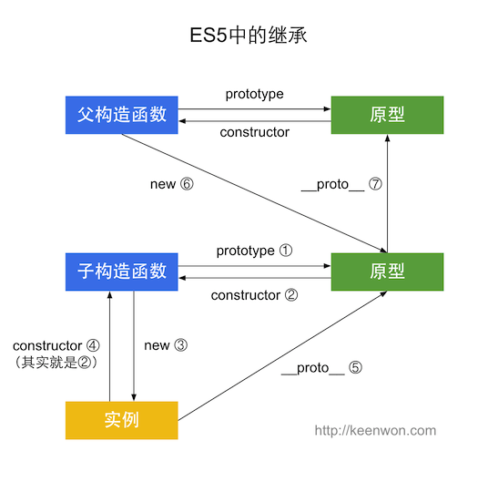

##　 ES5 实现继承的六种方式：

- 原型链继承
- 借用构造函数继承
- 组合继承
- 原型式继承
- 寄生式继承
- 寄生组合式继承

### 原型链继承

- 基本思路：利用原型让一个引用类型继承另一个引用类型的属性和方法，即让原型对象等于另一个类型的实例

```js
function Parent() {
  this.name = 'fedaily';
}

Parent.prototype.getName = function () {
  return this.name;
};

function Child() {}

// 这里也可以直接写出Child.prototype = Parent.prototype
// 但是这样就不能访问到父类的构造函数的属性了，即this.name
Child.prototype = new Parent();

var child = new Child();
child.getName(); // fedaily
```

- 最终结果：`child`指向`Child`的原型，`Child`的原型又指向`Parent`的原型，`getName()`方法任然在`Parent.prototype`中，但 name 则位于`Child.prototype`中，这是因为`name`是一个实例属性，而`getName`是一个原型方法。此时，`child.constructor`指向的是`Parent`。
- 原型链继承的问题
  - 父类构造函数中的引用类型（比如对象/数组），会被所有子类实例共享。其中一个子类实例进行修改，会导致所有其他子类实例的这个值都会改变
  - 第二个问题是，创造子类的实例时，不能向父类的构造函数中传递参数

### 借用构造函数继承

- 基本思路：在子类型构造函数的内部调用超类型构造函数，通过使用 apply()和 call()方法可以在将来新创建的对象上执行构造函数

```js
function Parent(name) {
  this.name = name;
  this.colors = ["red","blue","green"];
}

function Child() {
  Parent.call(this, 'Annika');
  this.age = 21;
}

var child1 = new Child();
console.log(child1.name);  // Annika
console.log(child1.age);   // 29

child1.colors.push("black");
console.log(child1.colors); // ["red","blue","green","black"]
​
var child2 = new Child();
console.log(child2.colors); // ["red","blue","green"]
```

- 通过`call`或者`apply`方法，我们实际上是在将来新创建的`Child`实例的环境下调用了`Parent`构造函数。这样一来，就会在新`Child`对象上执行`Parent`函数中定义的所有对象初始化代码，因此，每一个`Child`的实例都会有自己的`colors`对象的副本
- 优点：
  - 解决了原型链继承中构造函数引用类型共享的问题，同时可以向构造函数传参
- 缺点
  - 所有方法都定义在构造函数中，每次都需要重新创建（对比原型链继承的方式，方法直接写在原型上，子类创建时不需要重新创建方法）
  - 在父类原型中定义的方法，子类不可见

### 组合继承

- 基本思路：将原型链和借用构造函数继承的方式组合到一起。使用原型链实现对原型属性和方法的继承，用借用构造函数继承实现对实例属性的继承。这样既通过在原型上定义方法实现了函数复用，又能保证每个实例都有自己的属性

```js
function Parent(name){
    this.name = name;
    this.colors = ["red","green","blue"];
}
​
Parent.prototype.sayName = function(){
    console.log(this.name);
};
​
function Child(name,age){
    // 继承属性
    Parent.call(this,name);
    this.age  = age;
}
​
// 继承方法
Child.prototype = new Parent();
Child.prototype.constructor = Child;
Child.prototype.sayAge = function(){
    console.log(this.age);
};
​
var child1 = new Child('Annika',21);
child1.colors.push("black");
console.log(child1.colors); // ["red", "green", "blue", "black"]
child1.sayName(); // Annika
child1.sayAge();  // 21
​
var child2 = new Child('Anna',22);
console.log(child2.colors); // ["red", "green", "blue"]
child2.sayName(); // Anna
child2.sayAge();  // 22
```

- 优点：
  - 同时解决了构造函数引用类型的问题，同时避免了方法会被创建多次的问题
- 缺点：
  - 父类构造函数被调用了两次，一次是在创建子类原型的时候，一次是在子类构造函数的内部
  - 虽然根据原型链机制，并不会访问到原型对象上的同名属性，但总归是不美。

### 原型式继承

- 基本思路：不用严格意义上的构造函数，借助原型可以根据已有的对象创建新对象，还不必因此创建自定义类型

```js
function object(o) {
  function F() {}
  F.prototype = o;
  return new F();
}
```

- 从本质上讲，object()对传入其中的对象执行了一次浅复制

```js
var person = {
    name:'Annika',
    friendes:['Alice','Joyce']
};
​
var anotherPerson = object(person);
anotherPerson.name = 'Greg';
anotherPerson.friendes.push('Rob');
​
var yetAnotherPerson = object(person);
yetAnotherPerson.name = 'Linda';
yetAnotherPerson.friendes.push('Sophia');
​
console.log(person.friends);   //['Alice','Joyce','Rob','Sophia']
```

- 在这个例子中，实际上相当于创建了`person`的两个副本。
- **ES5**新增`Object.create`规范了原型式继承，接收两个参数，一个用作新对象原型的对象和（可选的）一个为新对象定义额外属性的对象，在传入一个参数的情况下，`Object.create()`和`object()`行为相同。

```js
var person = {
    name:'Annika',
    friendes:['Alice','Joyce']
};
​
var anotherPerson = object.create(person,{
    name:{
        value:"Greg"
    }
});
​
// 用这种方法指定的任何属性都会覆盖掉原型对象上的同名属性
console.log(anotherPerson.name);   // Greg
```

- 用处：创造两个相似的对象，但是包含引用类型的值的属性始终会共享响应的值

### 寄生式继承

- 基本思路：寄生式继承是与原型式继承紧密相关的一种思路，它创造一个仅用于封装继承过程的函数，在函数内部以某种方式增强对象，最后再返回对象。

```js
function createObject(original){
    // 通过调用函数创建一个新对象
    var clone = object(original);
    // 以某种方式来增强对象
    clone.sayHi = fuuction(){
        alert("Hi");
    };
    // 返回这个对象
    return clone
}
```

- 缺点：
  - 使用寄生式继承来为对象添加函数，会因为做不到函数复用而降低效率，这个与借用构造函数继承类似

### 寄生组合式继承

- 基本思路：通过**借用构造函数**来继承属性，通过原型链的混成形式来继承方法，不必为了指定子类的原型而调用父类的构造函数，只需要父类的一个副本。**本质上，就是使用*寄生式继承*来继承父类的原型，然后再将结果指定给子类的原型**

```js
function inherit(child, parent) {
  var prototype = object(parent.prototype); // 创建对象
  prototype.constructor = child; // 增强对象
  child.prototype = prototype; // 指定原型对象
}
```

- 因此，前面的例子可以改为如下的形式

```js
function Parent(name){
    this.name = name;
    this.colors = ["red","green","blue"];
}
​
Parent.prototype.sayName = function(){
    console.log(this.name);
};
​
function Child(name, age){
    // 继承属性
    Parent.call(this, name);
    this.age  = age;
}
​
// 继承方法
inherit(Child, Parent);
​
Child.prototype.sayAge = function(){
    console.log(this.age);
};
```

- 优点：这种方式就解决了组合继承中的构造函数调用两次，构造函数引用类型共享，以及原型对象上存在多余属性的问题，与此同时，原型链还能保持不变，还能正常使用`instanceof` 和`isPrototypeOf()`，因此，寄生组合式继承被认为是引用类型最理想的继承范式（除 ES6 的 class extends 继承）。

### 总结

- ES5 的继承可以用下图来概括
  

### ES6 继承

- 基本用法：Class 之间通过使用 extends 关键字，这比通过修改原型链实现继承，要方便清晰很多

```js
class Colorpoint extends Point {
  constructor(x, y, color) {
    super(x, y); //调用父类的constructor(x,y)
    this.color = color;
  }
  toString() {
    //调用父类的方法
    return this.color + ' ' + super.toString();
  }
}
```

- 子类必须在`constructor`方法中调用`super`方法，否则新建实例时会报错。这是因为子类没有自己的`this`对象，而是继承父类的`this`对象，然后对其进行加工，如果不调用`super`方法，子类就得不到`this`对象。因此，只有调用`super`之后，才可以使用`this`关键字。
- `prototype`和`__proto__`
  - 一个继承语句同时存在两条继承链：一条实现属性继承，一条实现方法的继承
  ```js
  class A extends B {}
  A.__proto__ === B; // 继承属性
  A.prototype.__proto__ == B.prototype; // 继承方法
  ```
- ES6的继承可以用下图来概括：

### 参阅
- [详解ES5和ES6的继承](https://www.cnblogs.com/annika/p/9073572.html)
- [彻底弄清js继承的几种实现方式](https://segmentfault.com/a/1190000022677985)